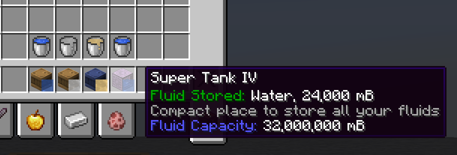
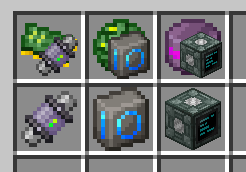
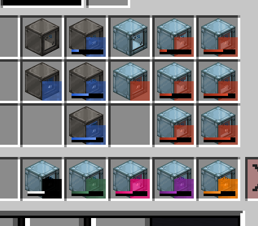

# GregTech Modern Quality of Life (GTM-QoL)

To help you improve your QoL when playing GregTech Modern.

## Features

If you're seeking some unique features to help improve this mod, feel free to open an issue!

### Tank Inspector

It renders the including content of a fluid tank (Drums, Super Tanks and Quantum Tanks).

### Data Stick (Alike) Inspector

It renders the output item of including recipe data for Data Sticks, Data Orbs and Data Modules.

### Tank Usage Durability Bar

It renders a durability bar to show the corresponding fluid in color. The length of the bar is calculated by the taken
amount of the tank.
